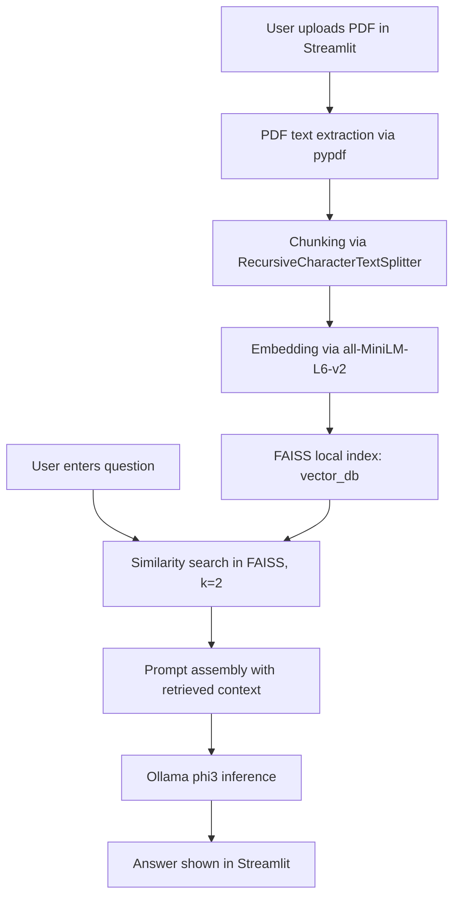

# Study Assistant (RAG + Streamlit + Ollama)

This project is a Retrieval-Augmented Generation (RAG) study assistant that reads a PDF, builds a FAISS vector index, and answers questions using retrieved context plus a local Ollama model.

## What It Currently Does

- Uploads a PDF from the UI.
- Extracts text from the PDF.
- Splits text into chunks.
- Embeds chunks using a sentence-transformer model.
- Stores embeddings in a local FAISS index.
- Retrieves top matching chunks for a user question.
- Sends context + question to an Ollama LLM (`phi3`) and displays the answer.

## Current Architecture



## Project Files Walkthrough

### App Entry

- `app.py`
  - Streamlit UI and orchestration layer.
  - Detects if `vector_db/` and `document_metadata.txt` exist.
  - If not loaded, asks for PDF upload and builds index.
  - If loaded, takes question input and returns answer.

### Modules

- `modules/pdf_loader.py`
  - Uses `pypdf.PdfReader` and concatenates extracted page text.
  - Works for text-based PDFs.
  - Limitation: scanned/image-based PDFs may return little or no text (no OCR).

- `modules/text_splitter.py`
  - Uses `RecursiveCharacterTextSplitter`.
  - Current params: `chunk_size=1000`, `chunk_overlap=200`.

- `modules/vector_store.py`
  - Embedding model: `sentence-transformers/all-MiniLM-L6-v2`.
  - Creates FAISS index from chunks and saves locally to `vector_db`.
  - Loads FAISS index for retrieval.

- `modules/rag_chain.py`
  - Returns `OllamaLLM(model="phi3")` instance.

### Data / Runtime Artifacts

- `Unit -II.pdf`
  - The intended source PDF in this workspace.

- `vector_db/`
  - Persisted FAISS index files.

- `document_metadata.txt`
  - Stores the last loaded document name.

## Does It Meet the Intended Goal?

Partially yes.

- It can answer questions based on content from an uploaded PDF.
- It does **not** currently auto-load `Unit -II.pdf` on startup; user upload flow is required unless index already exists.

## Gaps and Risks Identified

1. Auto-load for `Unit -II.pdf` is missing.
2. Dependency gap: `langchain_text_splitters` is imported but `langchain-text-splitters` is not explicitly listed in `requirements.txt`.
3. No explicit fallback when answer is not present in retrieved context.
4. No citations/sources shown in UI (retrieved chunks/pages hidden from user).
5. No strong handling for empty extraction (PDF contains no extractable text).
6. Uses `allow_dangerous_deserialization=True` when loading FAISS.
7. Uploaded files are saved directly in project root by original filename.

## Detailed Next Steps Plan

### Phase 1: Stability and Dependency Fixes (High Priority)

1. Update dependencies.
   - Add `langchain-text-splitters` to `requirements.txt`.
   - Pin package versions to reduce environment drift.

2. Add startup/runtime checks.
   - Validate Ollama service availability.
   - Validate `phi3` model availability and show actionable errors.

3. Improve error handling.
   - Guard against empty PDF text extraction.
   - Guard against empty chunk list before indexing.
   - Show user-friendly Streamlit error messages.

### Phase 2: Align with Intended Unit-II Workflow (High Priority)

1. Auto-process `Unit -II.pdf`.
   - On startup, if no `vector_db` exists, detect and process `Unit -II.pdf` automatically.
   - Keep upload option as an override action.

2. Add controlled storage.
   - Save uploaded PDFs in a dedicated folder such as `data/uploads/`.
   - Normalize filenames to avoid collisions.

### Phase 3: Answer Quality and Trustworthiness (High Priority)

1. Improve retrieval quality.
   - Increase `k` (for example to 4 or 5) and compare quality.
   - Consider `similarity_search_with_score` and threshold filtering.

2. Add grounded prompting.
   - Prompt model to answer only from context.
   - If context is insufficient, return: "I could not find this in the provided document."

3. Add source visibility.
   - Show top retrieved chunks in expandable sections.
   - Add source metadata (page numbers if available).

### Phase 4: Maintainability and Security (Medium Priority)

1. Refactor into reusable RAG pipeline service.
   - Separate UI code from ingestion/retrieval/inference service functions.

2. Reduce unsafe deserialization exposure.
   - Only load indexes created by this app in controlled local path.
   - Add integrity checks or regeneration path.

3. Logging and diagnostics.
   - Add structured logs for extraction/chunking/retrieval timings.

### Phase 5: Validation and Testing (Medium Priority)

1. Unit tests.
   - `pdf_loader`: extraction behavior on sample PDFs.
   - `text_splitter`: chunk count and overlap correctness.
   - `vector_store`: create/load and retrieval smoke tests.

2. Integration tests.
   - End-to-end test from ingestion to answer generation.

3. Acceptance tests for study use-cases.
   - Fact lookup questions.
   - Concept explanation questions.
   - Out-of-scope question behavior.

## Suggested Execution Order

1. Dependency + runtime checks.
2. Auto-load `Unit -II.pdf` path.
3. Better prompting + source display.
4. Robust error handling + storage cleanup.
5. Testing and refactoring.

## Run Notes (Current)

1. Install dependencies:
   - `pip install -r requirements.txt`
2. Ensure Ollama is installed and running.
3. Ensure model is available:
   - `ollama pull phi3`
4. Start app:
   - `streamlit run app.py`

## Ollama Configuration

The app now reads these environment variables:

- `OLLAMA_BASE_URL` (default: `http://127.0.0.1:11434`)
- `OLLAMA_MODEL` (default: `phi3`)

Examples:

- Local machine with local Ollama:
   - `OLLAMA_BASE_URL=http://127.0.0.1:11434`
   - `OLLAMA_MODEL=phi3`

- Streamlit Cloud (remote Ollama server):
   - Set `OLLAMA_BASE_URL` in app secrets/environment to your reachable Ollama endpoint.
   - Set `OLLAMA_MODEL` to a model that already exists on that server.

If Ollama is unreachable or the model is missing, the UI now shows an actionable error instead of crashing with a traceback.

## Cloud Fallback (Recommended)

The app now supports provider fallback:

- `LLM_PROVIDER=auto` (default): try Ollama first, then fallback to OpenAI if configured.
- `LLM_PROVIDER=ollama`: use only Ollama.
- `LLM_PROVIDER=openai`: use only OpenAI.

For Streamlit Cloud, the simplest setup is OpenAI:

- `OPENAI_API_KEY=<your_key>`
- `OPENAI_MODEL=gpt-4o-mini` (optional; default is `gpt-4o-mini`)

In Streamlit Cloud, set these in App Settings -> Secrets:

```toml
OPENAI_API_KEY = "your_key"
OPENAI_MODEL = "gpt-4o-mini"
LLM_PROVIDER = "auto"
```

If you still want Ollama in cloud, you must provide a real public endpoint in:

- `OLLAMA_BASE_URL=https://<reachable-host>`
- `OLLAMA_MODEL=phi3`

## Immediate Action Items

- Add `langchain-text-splitters` in `requirements.txt`.
- Implement auto-indexing for `Unit -II.pdf` when vector DB is missing.
- Add answer grounding and source citation display in UI.

## Deployment

This app is **not a good fit for serverless or static hosting** in its current form.

Why:

- It uses **Streamlit** as a long-running Python web app.
- It depends on a **local Ollama model** (`phi3`) for inference.
- It writes and reads **local files** such as `vector_db/` and `document_metadata.txt`.

That means the simplest production deployment is a **self-hosted VM or container** where you control the machine.

### Best Option: Deploy on a VM

Use a Windows or Linux VM on Azure, AWS, GCP, or any VPS provider.

#### 1. Provision the server

- Recommended: 4+ vCPU, 8+ GB RAM.
- More RAM helps if you run larger Ollama models.
- Open the app port you want to use, for example `8501`.

#### 2. Install system dependencies

Install:

- Python 3.10+
- Git (only if you plan to clone the repository on the server)
- Ollama

On the server, clone the project and enter the app folder.

```bash
git clone <your-repo-url>
cd study_assistant
```

If the project files are already on the server, you can skip Git entirely and just open the `study_assistant` folder there.

#### 3. Install Python packages

```bash
pip install -r requirements.txt
```

#### 4. Start Ollama and pull the model

```bash
ollama pull phi3
ollama serve
```

Keep `ollama serve` running as a background service or system service.

#### 5. Start Streamlit

```bash
streamlit run app.py --server.address 0.0.0.0 --server.port 8501
```

You can then access the app at:

- `http://<server-ip>:8501`

#### 6. Put a reverse proxy in front

For a cleaner deployment, place Nginx or Caddy in front of Streamlit and expose the app through port `80` or `443` with HTTPS.

### Docker Deployment

You can containerize the Streamlit app, but there is an important constraint:

- Ollama must also be available to the container.

You have two practical choices:

1. Run Ollama on the host machine and let the app container connect to it.
2. Run separate containers for the app and Ollama using Docker Compose.

If you want a cleaner production setup, use Docker Compose with:

- one service for Streamlit
- one service for Ollama
- a mounted volume for `vector_db/`
- a mounted volume for uploaded PDFs if you add an uploads folder later

### Platforms That Will Not Work Well As-Is

These are usually a poor fit without code changes:

- Streamlit Community Cloud
- Vercel
- Netlify
- GitHub Pages

Reason:

- They do not provide a persistent local Ollama runtime in the way this app expects.
- Local FAISS files may not persist reliably across restarts.

### If You Want Cloud Hosting Without Ollama on the Server

You should replace `OllamaLLM(model="phi3")` with a hosted model API, for example:

- OpenAI
- Azure OpenAI
- Groq
- Together AI
- Hugging Face Inference

After that change, the app becomes much easier to deploy on managed platforms because inference no longer depends on a local model server.

### Minimum Production Checklist

Before exposing this publicly, you should add:

- an uploads directory instead of saving PDFs in the project root
- file size limits for uploads
- validation for empty or scanned PDFs
- startup checks for Ollama availability
- a persistent process manager such as `systemd`, NSSM, or Docker restart policies
- HTTPS via reverse proxy

### Quickest Working Deployment

If your goal is simply to make it reachable from another machine, do this:

1. Create a VM.
2. Install Python and Ollama.
3. Run `pip install -r requirements.txt`.
4. Run `ollama pull phi3`.
5. Start Ollama.
6. Start Streamlit with `--server.address 0.0.0.0`.
7. Open port `8501` in the firewall.

That is the lowest-friction way to deploy the current code without refactoring it.
